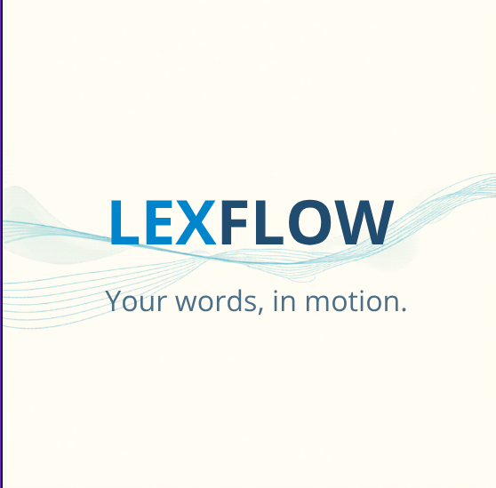

## Résumé
Nouveau logo officiel de [[lexflow]] fourni par l'utilisateur le 2026-06-10. Wordmark
**LEXFLOW** bicolore + tagline **« Your words, in motion. »** + motif d'**ondes**
(audio / mouvement) sur fond crème. Source : `raw/assets/lexflow-logo.png`.

## Claims clés
- Tagline **anglaise** : « Your words, in motion. » → bascule depuis l'ancien slogan FR
  « Apprends des mots sans avoir l'impression d'étudier. » → [[identite-visuelle]]
- Wordmark **bicolore** : `LEX` bleu vif, `FLOW` bleu marine.
- Motif d'**ondes** horizontales = renvoi direct à l'[[audio-first-learning]] (formes d'onde)
  et au [[feed-decouverte]] (« in motion »).
- Fond **crème/ivoire**, plus chaud que le gris Apple actuel de l'app.

## Palette extraite (PIL, valeurs réelles)
| Rôle | Hex |
|---|---|
| Fond ivoire | `#FFFDF3` |
| Bleu « LEX » (primaire) | `#0085CD` |
| Bleu marine « FLOW » | `#1F4C6F` |
| Ardoise (tagline) | `#4C6F89` |
| Accent violet (onde) | `#6B31C5` |
| Bleu clair (onde) | `#3BA1D6` |

## Entités
[[lexflow]]

## Concepts
[[identite-visuelle]] · [[audio-first-learning]] · [[feed-decouverte]]

## Citations
> « Your words, in motion. »

> [!warning] Divergence avec l'app implémentée
> Les tokens actuels du prototype (`styles.css`) sont : fond `#F5F5F7` (gris Apple),
> primaire `#0071E3`, accent `#BF5AF2`, tagline **FR**. Le logo introduit un fond
> **crème `#FFFDF3`**, un primaire **`#0085CD`**, un marine `#1F4C6F` et une tagline **EN**.
> À réconcilier avant prod. Voir [[identite-visuelle]].

## Questions ouvertes
- On bascule la marque en anglais (« Your words, in motion. ») ou bilingue ?
- On adopte le fond crème `#FFFDF3` à la place du gris Apple, ou logo seul ?
- Le primaire passe-t-il à `#0085CD` (logo) ou reste `#0071E3` (app) ?
